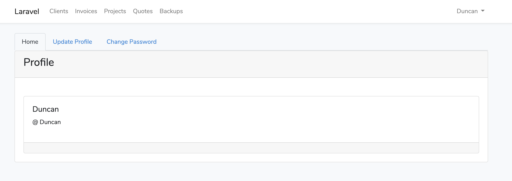
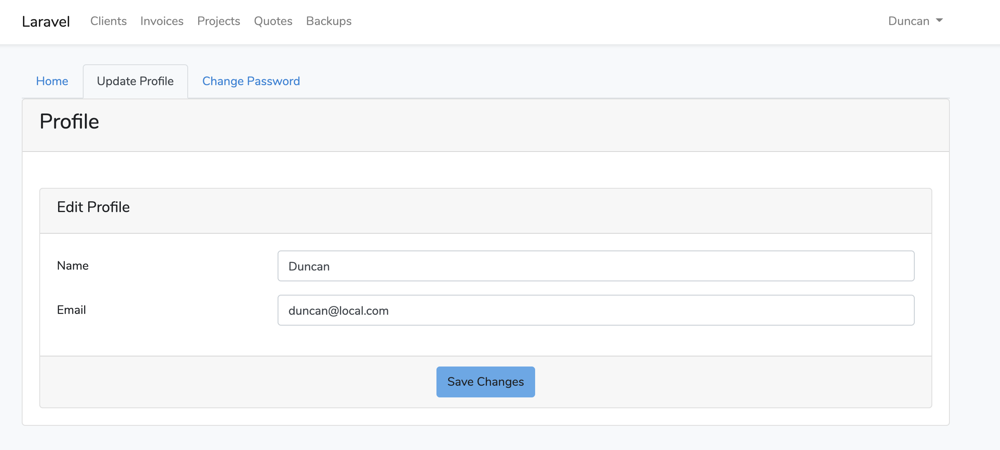

# Profile Package

[](//packagist.org/packages/duncanrmorris/profile)
[](//packagist.org/packages/duncanrmorris/profile)
[](//packagist.org/packages/duncanrmorris/profile)
[](//packagist.org/packages/duncanrmorris/profile)

## Introduction

The Profile package is designed to run within the Laravel ^7.2 application, giving you a quick and simple profile management tool for your users.

The Profile package is offered along side other packages from DRMorris IT Services, to checkout these other packages go to https://github.com/DRMorris-IT-Services


<br>


## Installation
To install this package within your Laravel application please follow these steps:

### Step 1
Setup the Laravel ^7.2 application as you require, then run the code:

```
composer require duncanrmorris/profile
```

### Step 2
Edit "config/app.php" file to add in the new Service Provider:

````
'providers' => [

        /*
         * Laravel Framework Service Providers...
         */
        Illuminate\Auth\AuthServiceProvider::class,
        Illuminate\Broadcasting\BroadcastServiceProvider::class,
        Illuminate\Bus\BusServiceProvider::class,
        ///
        duncanrmorris\profile\ProfileServiceProvider::class,
````
### Step 3
You can route to the profile page via "/profile" route.  You can add this to the Laravel application "resources/views/layouts/app.blade.php":

````
<!-- Right Side Of Navbar -->
                    <ul class="navbar-nav ml-auto">
                        <!-- Authentication Links -->
                        @guest
                            <li class="nav-item">
                                <a class="nav-link" href="{{ route('login') }}">{{ __('Login') }}</a>
                            </li>
                            @if (Route::has('register'))
                                <li class="nav-item">
                                    <a class="nav-link" href="{{ route('register') }}">{{ __('Register') }}</a>
                                </li>
                            @endif
                        @else
                            <li class="nav-item dropdown">
                                <a id="navbarDropdown" class="nav-link dropdown-toggle" href="#" role="button" data-toggle="dropdown" aria-haspopup="true" aria-expanded="false" v-pre>
                                    {{ Auth::user()->name }}
                                </a>

                                <div class="dropdown-menu dropdown-menu-right" aria-labelledby="navbarDropdown">
                                    <a class="dropdown-item" href="{{ url('/profile') }}">
                                        Profile
                                    </a>
                                    <a class="dropdown-item" href="{{ route('logout') }}"
                                       onclick="event.preventDefault();
                                                     document.getElementById('logout-form').submit();">
                                        {{ __('Logout') }}
                                    </a>

                                    <form id="logout-form" action="{{ route('logout') }}" method="POST" class="d-none">
                                        @csrf
                                    </form>
                                </div>
                            </li>
                        @endguest
                    </ul>
````


```
 <a class="dropdown-item" href="{{ url('/profile') }}">
                                        Profile
                                    </a>
```
